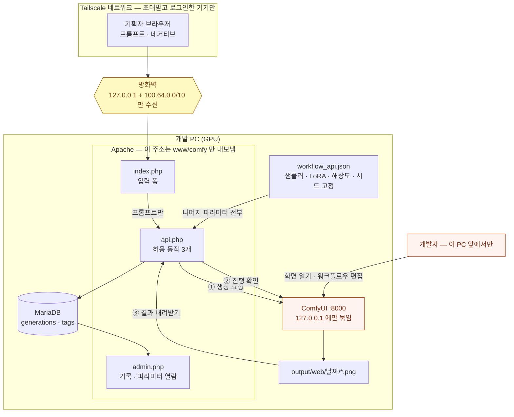

# 에셋 원격 생성기

Prowl's Moving Factory 의 에셋 생성을 위해 만들었습니다.
기획자 PC 로는 이미지 생성 모델을 돌릴 수 없어서, 개발 PC 의 GPU 를 원격으로 쓰게 하되
워크플로우는 고정해 에셋 톤이 흔들리지 않도록 했습니다.

집 PC 의 ComfyUI(RTX 3080) 를 Tailscale 안에서만 열어 두고,
브라우저에서 프롬프트만 넣으면 그림이 나오는 웹 폼입니다.

## 설계에서 정한 것

### 전체 구조



밖에서 되는 것은 `api.php` 를 통과하는 **①②③ 세 가지뿐**입니다.
ComfyUI 그 자체는 어느 경로로도 밖으로 나가지 않습니다.

### 만질 수 있는 것을 셋으로 줄였다

쓰는 사람이 건드릴 수 있는 건 **프롬프트 / 네거티브 / 결과 보기·저장** 세 가지뿐입니다.
샘플러·LoRA·해상도·스텝·시드는 `workflow.json` 워크플로우에 고정돼 있고 화면에 나오지 않습니다.

**기능을 덜 준 게 아니라 톤을 묶어 둔 것입니다.** 게임에 들어갈 에셋은 누가 언제 뽑았든
같은 화풍이어야 하는데, 생성 파라미터를 열어 두면 샘플러 하나만 달라져도 결이 갈립니다.
그래서 *톤을 정하는 값*은 전부 워크플로우 쪽에 두고, 화면에는 *내용을 정하는 입력*만 남겼습니다.
톤을 바꾸는 일은 워크플로우를 고치는 일이고, 그건 이 PC 앞에서만 됩니다.

### 개인 PC 를 여는 대신, 필요한 동작만 열었다

개발 PC 가 공유기 NAT 뒤에 있지 않은 환경이라, 대비 없이 Apache 를 켜면
`www` 폴더 전체가 그대로 노출됩니다. 그래서 무엇을 열지가 아니라
**무엇만 열지**를 먼저 정했습니다.

- **ComfyUI 자체는 밖으로 내보내지 않습니다.** `start-comfy.bat` 은 일부러
  `--listen 127.0.0.1` 로 띄웁니다. 밖에서 되는 것은 `api.php` 가 중계하는 세 가지 —
  생성 요청 / 진행 확인 / 결과 내려받기 — 뿐이고, ComfyUI 화면을 열거나 워크플로우를
  고치는 건 이 PC 앞에서만 됩니다. 원격에 준 것은 *서버*가 아니라 *동작 세 개*입니다.
- **닿을 수 있는 범위를 세 겹으로 좁혔습니다.** 방화벽(Tailscale 대역과 `127.0.0.1` 만) →
  가상호스트(`www\comfy` 밖은 404) → `.htaccess`(브라우저가 볼 이유 없는 파일 차단).
  하나라도 빠지면 같은 Laragon 아래의 다른 프로젝트 폴더가 노출됩니다 — 자세한 건 [접속 구조](#접속-구조).
- **관리자 비밀번호는 평문으로 디스크 어디에도 없습니다.** 해시로만 DB 에 있고,
  최초 설정은 `localhost` 에서만 됩니다. 원격에서 먼저 들어와 비밀번호를 선점하는 것을 막습니다.
- **원격 요청이 GPU 를 가로채지 못합니다.** 이 PC 앞에서 직접 작업하는 동안 생성 요청이
  들어오면 429 로 거절합니다 (`max_queue` = 1).

### 무엇에 쓰려고 만들었나

Prowl's Moving Factory 의 에셋을 세 갈래로 뽑을 자리를 만든 것입니다 —
**게임 내 일러스트**, 기획 단계의 **컨셉·톤 레퍼런스**, **스토어·홍보용 이미지**.
PMF 가 아직 에셋을 붙일 단계에 이르지 않아 실사용은 거의 없습니다.
필요해지는 시점에 기획자가 바로 돌릴 수 있도록 파이프라인을 먼저 세워 둔 것입니다.

셋이 **같은 워크플로우를 거치게** 한 것이 이 도구의 전제입니다. 스토어에서 본 그림과
게임을 켜서 보는 그림이 따로 놀면 안 되고, 그러려면 몇 달 간격으로 뽑은 것도 같은
화풍이어야 합니다. 사람이 매번 설정을 맞추는 방식으로는 그게 유지되지 않으므로,
톤을 정하는 값을 아예 손에서 뺐습니다 —
[만질 수 있는 것을 셋으로 줄인](#만질-수-있는-것을-셋으로-줄였다) 이유가 이것입니다.

## 켜는 순서

1. **ComfyUI 켜기** — `start-comfy.bat` 을 더블클릭
   (Comfy Desktop 앱을 켜도 됩니다. 같은 8000 포트를 쓰므로 **둘 중 하나만**)
2. **Laragon 켜기** — Apache 가 떠 있어야 웹 폼이 열립니다
3. 브라우저에서 접속
   - 이 PC에서: <http://localhost/comfy/>
   - 밖에서: `http://diffusion.example.com` (실제 주소는 저장소에 적지 않습니다)

## 접속 구조

목표는 **정해 둔 도메인 하나로 열리되, 아무나 들어오지는 못하는 것**입니다.
아래에서는 그 주소를 `diffusion.example.com` 으로 적습니다 — 실제 주소는 저장소에 두지 않습니다.
Tailscale 에 로그인한 기기만 닿을 수 있게 세 겹으로 막아 뒀습니다.

| 겹 | 무엇을 막나 |
|---|---|
| 방화벽 | Apache 인바운드를 `127.0.0.1` 과 `100.64.0.0/10`(Tailscale 대역) 에서만 받습니다 |
| 가상호스트 | 이 도메인은 `www\comfy` 만 내보냅니다. 다른 프로젝트 폴더는 404 |
| 기본 사이트 차단 | Tailscale 대역에서 `100.x.x.x` 로 직접 쳐도 `www` 목록을 볼 수 없습니다 |

`.htaccess` 가 `workflow_api.json`, `start-comfy.bat`, `tools/` 처럼
브라우저가 볼 이유가 없는 것들을 추가로 막습니다.

### 남은 설정 (Tailscale 설치 후)

1. <https://tailscale.com/download/windows> 설치 → 로그인
2. `tailscale ip -4` 로 이 PC 의 `100.x.x.x` 확인
3. DNS 에 `diffusion` **A 레코드 → 그 IP** 추가
4. 쓸 사람은 관리 화면(Users → Invite)에서 초대하고, ACL 로 이 PC 의 80/443 만 열기

```json
{"action": "accept", "src": ["쓸사람@example.com"], "dst": ["tag:comfy:80,443"]}
```

초대받은 사람도 **자기 기기에 Tailscale 을 설치하고 로그인해야** 합니다.
주소만 알려 준다고 열리지 않습니다.

### https

지금은 Laragon 의 자체 서명 인증서라 `https://` 로 열면 브라우저가 경고를 냅니다.
`100.x.x.x` 는 사설 대역이라 Let's Encrypt 의 HTTP-01 검증을 쓸 수 없으므로,
**DNS-01** 방식으로 인증서를 받아
`C:\laragon\etc\apache2\sites-enabled\<도메인>.conf` 의
`SSLCertificateFile` / `SSLCertificateKeyFile` 두 줄만 바꾸면 됩니다.

### 방화벽 제한 되돌리기

```
powershell -ExecutionPolicy Bypass -File tools\restrict-firewall.ps1 -Revert
```

제한을 걸면 LAN(192.168.x.x) 과 인터넷에서 **Laragon 의 모든 사이트**가 막힙니다.
comfy 뿐 아니라 같은 Laragon 아래에 있는 다른 프로젝트까지 전부입니다.
`localhost` 는 그대로 됩니다.

**Apache 를 다시 켤 때 Windows 방화벽 팝업이 뜨면 [취소] 를 누르세요.**
[액세스 허용] 을 누르면 모든 주소를 허용하는 규칙이 다시 생겨 제한이 무의미해집니다.

## 파일

| 파일 | 하는 일 |
|---|---|
| `index.php` | 입력 폼 화면 |
| `assets/app.js` | 요청 보내고 1.5초마다 진행 확인 |
| `api.php` | ComfyUI 프록시. 브라우저는 여기하고만 대화합니다 |
| `config.php` | 노드 번호, 저장 경로, 큐 제한 |
| `workflow_api.json` | 실제 워크플로우를 API 포맷으로 바꿔 둔 것. **저장소에 없습니다** (아래 참고) |
| `workflow_api.example.json` | 위 파일의 구조만 남긴 예시. 모델·LoRA 이름은 자리표시자 |
| `tools/convert_workflow.py` | 위 파일을 다시 만드는 변환기 |
| `admin.php` | 관리자 페이지 — 만든 이미지와 파라미터 보기 |
| `lib/db.php` | 생성 기록 저장 (MariaDB) |
| `lib/prompt.php` | 프롬프트를 태그로 쪼개고, 워크플로우에서 파라미터를 뽑아냄 |
| `lib/thumb.php` | 목록용 썸네일 생성·캐시 |
| `tools/backfill.php` | 이미 만든 이미지를 PNG 메타데이터로 DB 에 불러오기 |
| `tools/restrict-firewall.ps1` | Apache 를 로컬 + Tailscale 에서만 받도록 제한 (`-Revert` 로 원복) |
| `tools/get-cert.bat` | Let's Encrypt 인증서 발급 (90일마다) |
| `config.local.php` | 관리자 비밀번호 등 이 기기에만 두는 설정 (저장소에 안 올라감) |
| `.htaccess` | 브라우저가 볼 이유 없는 파일 차단 |
| `start-comfy.bat` | ComfyUI 를 생성 엔진으로만 띄우기 |

### 워크플로우 파일이 저장소에 없는 이유

`workflow_api.json` 에는 이 파이프라인이 쓰는 **체크포인트와 LoRA 파일명이 경로째** 들어갑니다.
어떤 모델을 썼는지는 이 도구를 이해하는 데 필요한 정보가 아니고,
모델마다 배포 조건(비상업 여부 등)이 달라 그대로 공개할 성질도 아닙니다.
그래서 실제 파일은 이 기기에만 두고, 저장소에는 이름을 자리표시자로 바꾼
`workflow_api.example.json` 만 올립니다.

노드 구성·연결·고정한 파라미터는 예시 파일에 그대로 있으므로,
**구조는 예시 파일만 봐도 전부 파악됩니다.** 바뀌는 것은 모델 이름뿐입니다.

직접 돌려 보려면 `workflow_api.example.json` 을 `workflow_api.json` 으로 복사한 뒤
`base/your-checkpoint.safetensors` 와 `lora/your-lora-N.safetensors` 를 자기 모델 경로로
바꾸거나, ComfyUI 에서 워크플로우를 만들어 `tools/convert_workflow.py` 로 내보내면 됩니다.

Apache 쪽 설정은 프로젝트 밖에 있습니다:

| 파일 | 하는 일 |
|---|---|
| `C:\laragon\etc\apache2\sites-enabled\<도메인>.conf` | 이 주소가 `www\comfy` 만 내보내게 |
| `C:\laragon\etc\apache2\sites-enabled\00-default.conf` | 기본 사이트를 Tailscale 대역에서 차단 (원본은 `.bak`) |

생성된 이미지는 `G:\comfy\output\web\날짜\시각_시드_00001_.png` 에 쌓입니다.
ComfyUI 에서 직접 만든 것(`img\...`)과 폴더가 나뉘어 섞이지 않습니다.
이 PC 에서는 이 폴더를 열어 만든 것을 전부 볼 수 있습니다 — 웹에서 지우는 기능은 없습니다.

내려받을 때는 날짜가 이름 앞에 붙습니다: `2026-08-09_134356_814520644439968.png`.
폴더에 있던 날짜를 파일 이름으로 옮겨, 받아 놓고 나서도 언제 만든 것인지 알 수 있게 한 것입니다.

## 관리자 페이지

`/admin.php` 에서 만든 이미지를 전부 훑어볼 수 있습니다.

- **썸네일 그리드** — 원본이 한 장에 1.5MB 라 그대로 띄우면 감당이 안 되므로,
  긴 변 360px JPEG 을 만들어 `data/thumbs` 에 캐시합니다 (1/100 크기)
- **카드를 누르면** 그 이미지와 함께 **그때 쓴 파라미터가 전부** 나옵니다 —
  모델, 샘플러, 스텝, CFG, 해상도, Hires 설정, LoRA와 강도, 노드별 시드
- **태그** — 프롬프트를 태그로 쪼개 저장합니다. 태그를 누르면 그 태그가 들어간 것만 모아 봅니다
- **검색·필터** — 프롬프트 본문 검색, 상태별(완성/생성중/실패) 필터

### 비밀번호

**설정 파일에 비밀번호를 적지 않습니다.** DB 의 `admin_auth` 테이블에
`password_hash()` 로 만든 되돌릴 수 없는 해시로만 저장합니다.
이렇게 하면 평문이 디스크 어디에도 남지 않아, 백업이나 화면 공유로도 새지 않습니다.

- **처음 한 번** — 이 PC 에서 <http://localhost/comfy/admin.php> 로 들어가면
  비밀번호를 정하는 화면이 나옵니다 (8자 이상)
- **바꿀 때** — 관리자 페이지 오른쪽 위 `비밀번호` 메뉴
- **잊었을 때** — `DELETE FROM admin_auth;` 로 지우면 다시 정할 수 있습니다.
  단 그 뒤로는 이 PC 앞에서만 정할 수 있습니다

최초 설정은 **`localhost` 에서만** 됩니다. 원격에서 먼저 들어와 비밀번호를
차지하는 것을 막기 위해서입니다. Tailscale 주소로 들어오면 "이 PC 앞에서
정하세요" 라는 안내만 보입니다.

Tailscale 안이라 해도 초대한 사람은 들어올 수 있으므로 한 겹 더 막는 것입니다.

## 생성 기록 (MariaDB)

DB 이름은 `diffusion` 입니다.

| 테이블 | 내용 |
|---|---|
| `generations` | 생성 1건. 프롬프트, 파라미터, 결과 파일, 실행한 워크플로우 전체 |
| `tags` | 프롬프트에서 쪼갠 태그 |
| `generation_tags` | 이미지와 태그의 연결 (포지티브/네거티브, 가중치) |
| `admin_auth` | 관리자 비밀번호 해시 (한 행만 씁니다) |

**DB 가 꺼져 있어도 이미지 생성은 그대로 됩니다.** 기록만 빠집니다 —
MariaDB 때문에 그림을 못 만드는 일이 없도록 일부러 그렇게 해 두었습니다.

### 이미 만든 이미지 불러오기

ComfyUI 는 PNG 안에 그때 실행한 워크플로우를 통째로 심어 둡니다.
그래서 이 웹 폼을 만들기 전에 만든 그림도 프롬프트와 파라미터를 되살릴 수 있습니다.

```
php tools\backfill.php          출력 폴더 전체
php tools\backfill.php web      web 폴더만
php tools\backfill.php --dry    무엇이 잡히는지 확인만
```

여러 번 돌려도 안전합니다. 이미 있는 것은 파라미터만 다시 읽어 갱신합니다.

## 내가 만든 것

웹 폼 아래에 **내가 만든 최근 20개**가 썸네일과 함께 나옵니다.
DB 에서 가져오므로 브라우저 기록을 지워도 남고, PC 에서 만든 것을 폰에서도 이어 볼 수 있습니다.

- 항목을 누르면 그 프롬프트와 네거티브가 입력칸에 다시 채워집니다
- 오른쪽 `⤓` 로 다시 받을 수 있고, 한 번 받으면 `✓` 와 `받음` 으로 바뀝니다

### 누구 것인지 어떻게 아나

`tailscale whois` 가 접속한 주소를 **기기 이름과 로그인 계정**으로 바꿔 줍니다.

```
100.x.x.x  ->  planner-laptop / someone@github (표시 이름)
```

그래서 IP 가 아니라 **계정으로** 묶습니다. 같은 계정이면 PC 든 폰이든 한 목록으로 보이고,
초대한 사람은 자기가 만든 것만 봅니다. 관리자 페이지에서는 어느 기기에서 누가 만들었는지도 나옵니다.

조회 결과는 한 시간 동안 `data/whois` 에 캐시합니다. 요청마다 프로세스를 띄우지 않기 위해서입니다.
이 PC 에서 `localhost` 로 들어오면 Tailscale 을 거치지 않아 조회되지 않으므로 `이 PC` 로 표시합니다.

브라우저가 저장 완료를 알려주지는 않으므로, `받음` 은 정확히는 *받기를 눌렀다* 는 표시입니다.

## 워크플로우를 고쳤다면

ComfyUI 화면에서 워크플로우를 수정한 뒤:

```
G:\comfy\.venv\Scripts\python.exe tools\convert_workflow.py
```

ComfyUI 가 켜져 있어야 합니다 — 실제 노드 스펙을 `/object_info` 에서 받아
위젯 순서를 맞추기 때문입니다.

**노드 번호가 바뀌었다면** `config.php` 의 `nodes` 매핑도 함께 고쳐야 합니다.
현재 매핑:

| 역할 | 노드 | 종류 |
|---|---|---|
| 포지티브 | 116 | ImpactWildcardEncode |
| 네거티브 | 107 | CLIPTextEncode |
| 1차 샘플러 | 117 | KSampler |
| 결과 저장 | 92 | SaveImage |

## 알아 둘 것

- **프롬프트에 `<lora:이름:0.9>` 를 그대로 쓸 수 있습니다.** webui 문법을
  ImpactWildcardEncode 가 해석합니다. 와일드카드 `__이름__` 도 됩니다.
- **호스트가 공유기 NAT 뒤에 있지 않다면**, 방화벽을 제한하기 전까지 인터넷에서
  `www` 폴더 전체에 닿을 수 있습니다. `tools\restrict-firewall.ps1` 이 그것을 막습니다
  — 되돌리면 다시 열리므로, 되돌린 채로 두지 마세요.
- **그리는 중에는 새 요청을 아예 받지 않습니다.** 원격에서 생성 버튼을 눌러도
  `지금 다른 그림을 그리는 중입니다` 로 거절됩니다. 이 PC 앞에서 ComfyUI 로
  직접 작업하는 동안 원격 요청이 GPU 를 가로채지 않게 하려는 것입니다.
  (`config.php` 의 `max_queue`, 1 을 유지하세요)
- 한 장에 40~60초 걸립니다. ComfyUI 를 막 켠 직후 첫 장은 모델을 올리느라 더 걸립니다.
